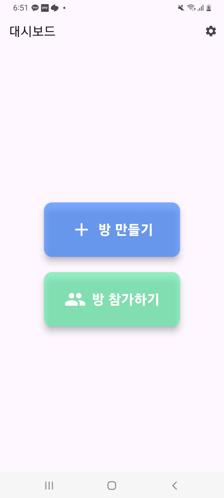
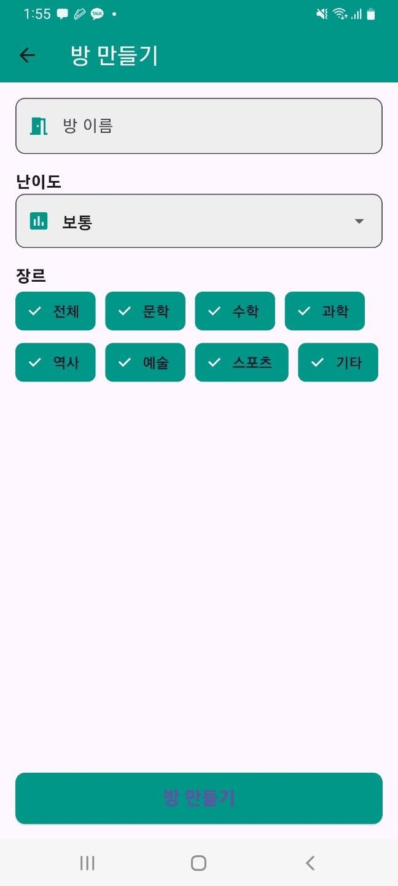
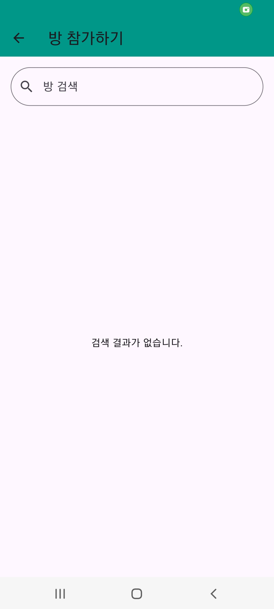
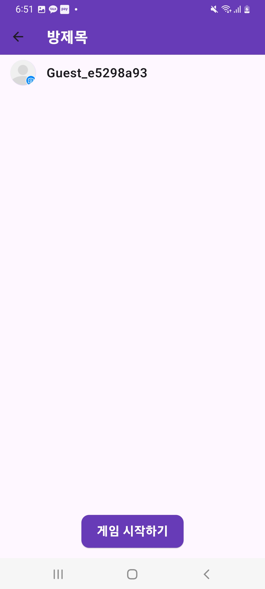
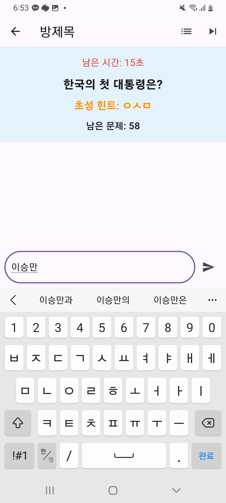
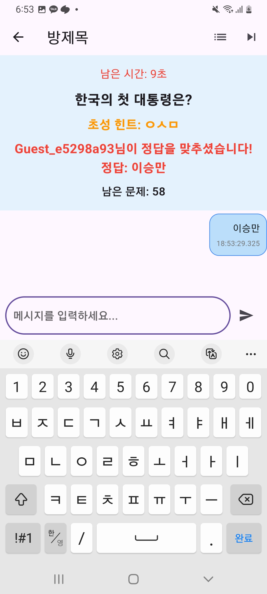
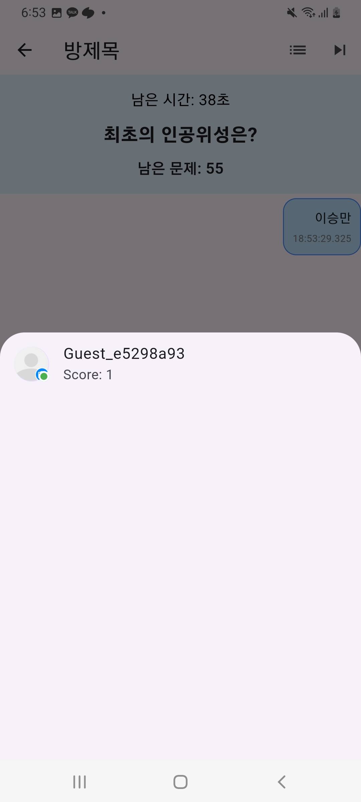

# chat_game
프로젝트 개요

Chat Game은 실시간으로 진행되는 멀티플레이 상식 퀴즈 게임입니다. 사용자들은 방을 생성하거나 기존 방에 참여해 다른 플레이어와 대결할 수 있습니다. 제한된 시간 안에 가장 빠르게 정답을 입력한 플레이어가 점수를 획득하는 방식으로 진행됩니다.

Firebase를 활용한 실시간 데이터 관리.

Flutter 기반의 크로스플랫폼 지원.

기술 스택

Flutter: 네이티브처럼 작동하는 크로스플랫폼 UI 프레임워크.

Firebase: 실시간 데이터베이스와 사용자 인증.
<h2>대시보드</h2>

<h2>방 만드는 화면</h2>

<h2>방 들어가는 화면</h2>

<h2>방 로비 화면</h2>

<h2>게임 화면</h2>

<h2>정답을 맞췄을 때</h2>

<h2>점수 화면</h2>

