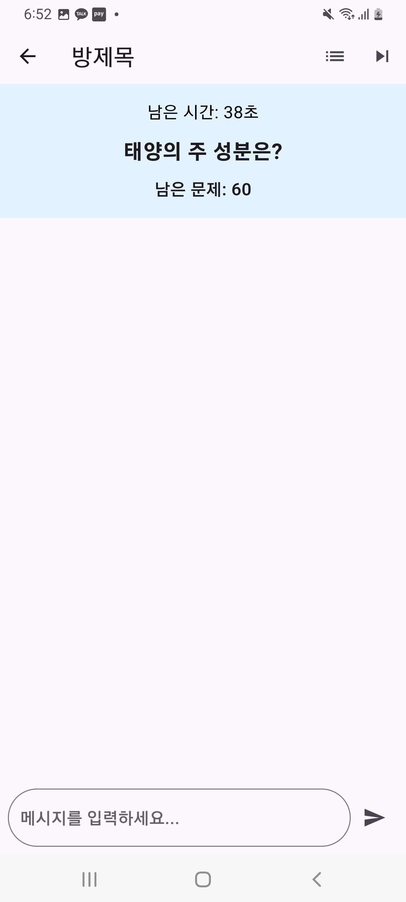

# chat_game
상식 퀴즈 게임
이 프로젝트는 Firebase와 Flutter를 사용하여 개발된 상식 퀴즈 게임입니다.
방을 만들거나 방을 들어가서 다른 유저와 게임을 할 수 있습니다
게임의 특징은 제한된 시간 동안 퀴즈 문제를 가장 먼저 입력한 사람에게 점수가 들어가는 형식입니다. 

<h2>대시보드</h2>

<h2>방 만드는 화면</h2>

<h2>방 들어가는 화면</h2>

<h2>방 로비 화면</h2>

<h2>게임 화면</h2>

<h2>정답을 맞췄을 때</h2>

<h2>점수 화면</h2>

